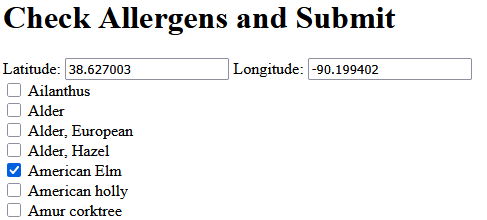
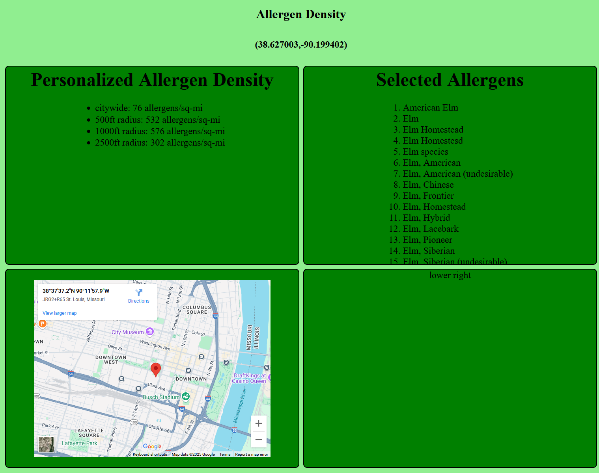
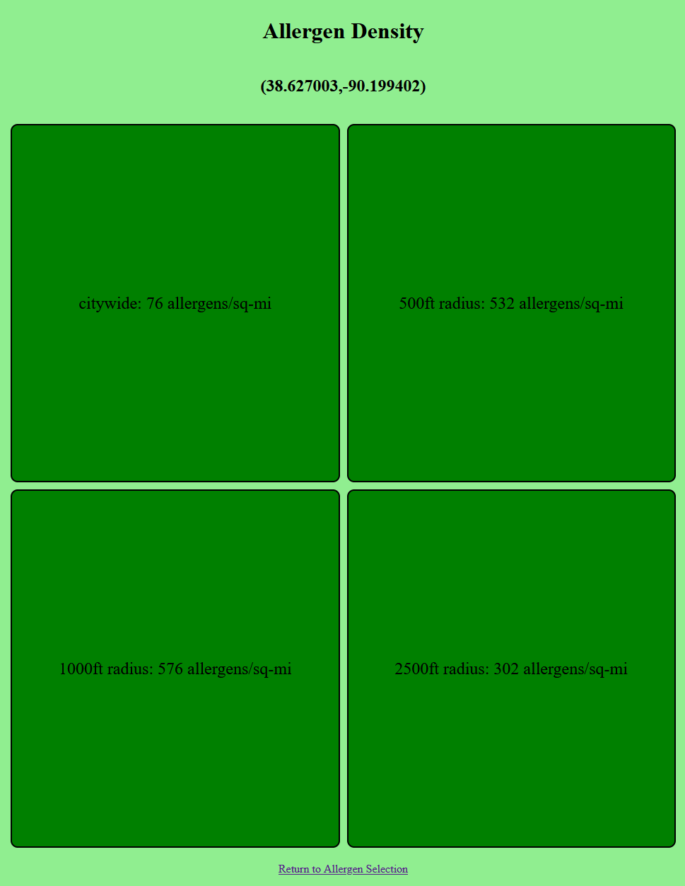
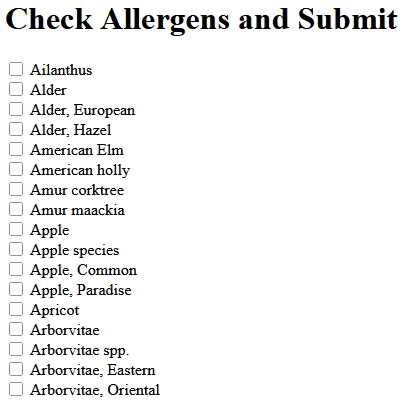
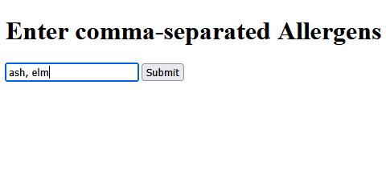
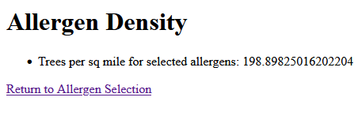
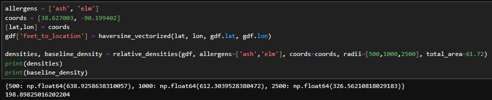
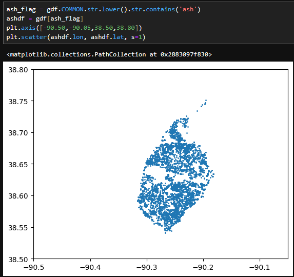

# Week 10

During Week 10, I refactored the project a bit, moving it towards being a single page. Originally I went with one selection page and then a second results page because I was concerned about performance with 100k+ data points to iterate over on the backend each time. But I did some testing and refactoring and found that by pre-calculating the density for each of the ~650 tree species in the 4 different radii (500ft, 1000ft, 2500ft, citywide), I could actually just send that data to the front end in one chunk and then update the displayed results instantly in front-end JavaScript. 

This will enable a single page structure and a much more responsive feel for the app with a very small tradeoff (the density rings themselves are fixed when Flask sends the data to the front-end). Overall I was very pleased as at the start of the project never would have though it could be so snappy being a simple web app. 

Just look at it go!:

That said, it is still visually not at the end point yet. Next week I will prioritize moving some things around, cleaning up the code, and converting it to a single page rather than 2-page site. I also want to do some testing on a toggleable radius so the user isn't locked into the 3 preset values.

There are no major blocks right now.

# Week 9 (7/14/25 - 7/20/25)
During Week 9, I added a feature that automatically detects the user's location after their approval via a pop-up in the browser. These lat/lon coordinates are then used to auto-populate the html form that ultimately provides the backend with the information it needs to generate the results page.

The user can still enter their own custom coordinates if so desired.

My plan next is to do more with the mapping portion of the results page to visualize what the concentric rings are and potentially even plot the allergens if it doesn't slow the app down.

There are no major blocks to progress.

# Week 8 (7/7/25 - 7/13/25)
During Week 8, I enhanced the UI display. It now also shows which allergens were selected on the prior screen and includes an embedded map from Google Maps showing the location. 
The "Selected Allergens" section has a scroll bar for cases when more species are selected than will fit on the screen. It still doesn't look very visually appealing but there is functionality there at least now.

My plan next is to look into adding concentric circles around the center point on the map to visualize the different radii displayed on top. I also want to display a bit more data in the "Personalized Allergen Density" section to maybe show the absolute count of allergens and some smaller radii. The "Selected Allergens" may also become the allergen selecter portion, so the app itself will become one page instead of a selection->results system.

There are no major blocks to progress. One possible block is that Google Maps requires an API key for certain features.

# Week 7 (6/30/25 - 7/6/25)
During Week 7, I developed a UI display for the results that is at least not hostile to the reader's eye. I hope to improve the look and feel of this and potentially add a map or other information in the boxes.

Through the process of building this I became more familiar with how Flask uses HTML templates.

A picture tells a thousand words:

Up next is working on the front-end UI. Making something that enables the user to exploit the granularity of the data available while also not being overwhelming/tedious is going to be tricky.

There are no current blocks to progress.

# Week 6 (6/23/25 - 6/29/25)
During Week 6, I explored different potential UI layouts on the front-end. Initially, the user would manually enter comma-separated text (ex: "ash, elm"), and the app would respond by filtering out all trees that didn't contain one of the provided text strings. However, this doesn't provide what the available options are, subvarieties of tree that may be relevant, and exposes the app to spelling mistakes. The layout below is an alternative that comes at the cost of much more laborious user input. It is constructed by sorting a unique list of valid tree identifiers from the dataset. A downside of this approach is also that instances such as "Elm, American" and "American Elm" will show up in very different places in the checkbox list.

My goal is to try to find a happy medium between these two approaches. Ultimately I am envisioning a checkbox list that allows input text to temporarily filter and "check all." This way, a user could quickly search for ash, select all, search for elm, select all, and move on. However, this isn't native behavior for html forms, so I will be looking for a library with this functionality.

There are no current blocks to progress.

# Week 5 (6/16/25 - 6/22/25)
During Week 5, I built a rudimentary Flask app that I can run locally. It has a very simple form page where comma-separated allergens can be submitted. Those are then processed using the dataset from St. Louis' forestry division to calculate the baseline density (allergens per sq mile) for the whole city and this density value is displayed as shown below.

I have to say, even this very simplistic UI has been very gratifying to build and see bear fruit. The next steps will be adding the lat/lon to the submission form (to be replaced with a location sharing hopefully) and displaying multiple densities for different rings around the location. I'd also like to improve the UI beyong the minimalist, information-only state it is now in.

Unfortunately something broke in my density function in porting it from a .ipynb notebook to Flask. It calculates the baseline density but returns all 0s for density within 500/1000/2500 feet. For now, that is a block on progress.

# Week 4 (6/9/25 - 6/15/25)
During Week 4, I primarily worked on setting up my personal site (here!). I have a lot to do in terms of improving its visual appeal, but the links now work together and I have a baseline going. On that front, I need to update my resume, settle on a style for the site, and perhaps link to some other web-based projects of mine in the technical skills section.

On the actual project side of things, I completed the allergen density function that the site will use to produce the fundamental functionality of the app. This function will run on the server, takes in the parameters shown, and produces allergen densities (tree count per sq mi) as instructed as well as the "baseline" which is the allergen density for the provided tree species for the city overall. Below is its usage, although the inner workings contain most of the complexity.

There are no current blocks to progress.

# Week 3 (6/2/25 - 6/8/25)

During Week 3, I read over some of the other projects and offered feedback.

On my own project, I did further analysis in a JuPyter notebook and set up some preliminary functions to work with the data. Below is a snapshot from the notebook in which I generate a plot of all ash trees (my primary pollen allergen) in St. Louis:

This visual was helpful to me in verifying that the lat/lon is working correctly and that the data is what I'd expect. In this case, the ash trees are spread all over the city, so a plot of them reveals essentially a map of St. Louis. Also visible is the "central corridor" running east to west through the middle, which is the most urban part of the city and thus the area with the fewest trees. Also, since the dataset is limited to public roads, various campuses and large parks are also visible as "holes" in the data. These holes may be something to come back to, but for now the point of this and other data exploration is just to get a feel for it and how I might best make use of it down the line.

Right now, there are no blocks to progress. The main future block that I can currently anticipate is learning Flask in order to implement a back-end to the site - Python/Pandas to manipulate the data and HTML/JS for the front-end are not new to me.

Like last week, I need to improve on uploading things to GitHub to keep it organized as well as document progress. Already I have mistakenly deleted code in a way that would be trivial to fix with a version history using Git.

# Week 2 (5/26/25 - 6/1/25)

During Week 2, I formalized my project into a project proposal and did some preliminary analysis of the tree geographic data that my project will be built upon.

This week I plan to continue the data analysis. Part of the preliminary step is a proof of concept for calculating allergen density given the various toggles that will be available to the user. Additionally, the data will need a bit of light cleaning to remove missing or irrelevant values. Just getting a feel for how the fields work though will be important for efficiently implementing what I need.

There are no blocks at this time. Right now I am working with an extract of the data inside a JuPyter notebook, so no new tools to learn or anything (yet).

To improve the process over last week, I think organizing things in GitHub will be helpful going forward to have everything in one place and clearly laid out.

# Week 1 (5/19/25 - 5/25/25)

During Week 1, I familiarized myself with the course structure, got my bearings on GitHub pages, and started scoping out my project plans. 

I don't want to overshoot the project parameters by setting goals that are too ambitious nor undershoot and end up completing it too soon. To account for this, I plan to structure my project as a minimal viable product followed by incremental feature additions. 
This way the core of the project will definitely be completed by the end of the course, but there will still be room to keep working if there are still weeks remaining at the end.

So far, the main impediment is just ironing out the project plan (which I plan do to this week) and learning the different tools/technologies necessary to pull it all together.
I am taking two courses this semester, and my usual practice in this situation is to finish the coursework for each in sequence, but going forward I think it will make more sense to work on portions of each so that this course doesn't end up squished into the end of the week.
